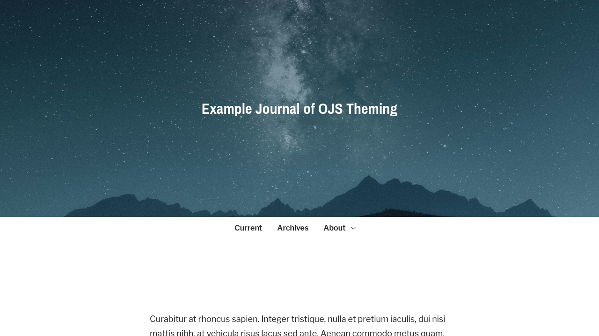

# Usage Guide for Individualize Theme

> This theme is available for OJS 3.3.0-21+. If it is not listed in **Settings > Website > Plugins > Plugin Gallery**, it is not compatible with the version of OJS you are running.

The Individualize theme includes several theme options to adjust the colors and layout of your site. It also integrates with plugins to support custom fonts, showing partner and supporting institutions, and more.

This guide is designed to help you understand the options that are available. It also warns you about design decisions that could make your site look unprofessional or be inaccessible to everyone.

## Getting Started

Once you have installed and enabled the theme in OJS, you can activate it by going to **Settings > Website > Appearance > Theme**. Once selected, save the form to activate it on your site.

You may not see all theme options unless you have also installed and enabled the following plugins.

- Google Fonts
- Partner Logos

## Theme Options

### Header

The following are examples of the three header layout options.

| Option | Example |
| --- | --- |
| Default |  |
| Default (Centered) |  |
| One Line |  |

### Tagline

This option can be useful if the journal has a short description, motto, or other text that needs to accompany a logo.

### Homepage Image Position

This setting controls the position of the homepage image, which you can upload at **Settings > Website > Appearance > Setup > Homepage Image**.

If using one of the "behind header" options, care must be taken to ensure that text can be read clearly against the background image.

| Bad | Good |
| --- | --- |
|  |  |

The following shows the most common options for the homepage image position.

| Option | Example |
| --- | --- |
| Above Header |  |
| Above Header (Center) |  |
| Behind Header |  |
| Behind Header (Center Right) |  |
| Behind Header (Repeating Pattern) |  |
| Below Header |  |

### Homepage Blocks

This setting allows you to add, remove, and reorder content on the homepage. Some of the blocks are not available unless you have a plugin enabled.

| Block | Description |
| --- | --- |
| About the Journal with Homepage Menu | Show a short description of the journal along with buttons. Use this near the top of your homepage to provide a brief introduction to your journal and links to the most common resources, like the issue archive or the submission page. This block will display the content added to **Settings > Website > Advanced > Additional Content** or **Settings > Journal > About the Journal**. Add links to this block by creating a Menu at **Settings > Website > Setup > Navigation**. When creating the menu, assign it to the `homepage` **Active Theme Navigation Area**. |
| Browse by Category | Show a list of your article categories with a link to view all articles in each category. Enter a title and description for this block in the fields below this setting. |
| Current Issue (Summary) | Show the current issue cover, volume, number, and title along with issue description. |
| Current Issue (Table of Contents) | Show the current issue's full table of contents. |
| Highlights | Display the journal's highlights. (Only available in OJS 3.5+.) |
| How to Submit | Show a small highlighted block with details about how to submit. Enter a title and description for this block in the fields below this setting. |
| Latest Announcement | Show one or more of your most recent announcements. Announcements must be enabled at **Settings > Website > Setup > Announcements**. |
| Latest Articles | Show a list of the most recently published articles. This is only useful for journals operating a publish-as-you-go model. Enter a title and description for this block in the fields below this setting. |
| Latest Articles (with Cover Images) | The same as the Latest Articles block above, but each article's cover image will be display. Only enable one of these two settings. |
| Partners / Sponsors | Show a grid of partner logos. Enter a title and description for this block in the fields below this setting. (The **Partner Logos** plugin must be installed and enabled.) |
| Plugin Content | Add this block if the journal uses a plugin that automatically adds content to the homepage. |

### Highlight Article Metadata

In the Individualize theme, most of the article metadata appears in a table at the bottom of the article. This option allows you to show some key information, like keywords or a DOI, directly under the title and author.

The **Published In Issue/Journal** setting provides a snapshot of the issue the article was published in. This can reinforce the source of the article for users who reached the article landing page directly, rather than through browsing the journal site.

### Article HTML Full Text

> More documentation on this feature will be available soon.

The theme includes a feature to extract the full text from a HTML galley and display it directly on the landing page. This only works with specific HTML galleys.

### Issue Archives

It is recommended that you only show cover images on the issue archive if each issue has a visually unique cover.

| Option | Example |
| --- | --- |
| List of issue summaries |  |
| Galley of issue cover images |  |
| List of issue summaries without cover images |  |

## Fonts

When you have installed and enabled the **Google Fonts** plugin, the theme allows you to assign fonts from that plugin to specific parts of the theme.

## Colors

> It is **strongly recommended** to use the theme's simple color mode. When using the simple color mode, the theme automatically adjusts all elements to ensure they are legible and provides a base level of support for accessibility criteria in color selection.

When you have selected the **Simple Mode**, the theme allows you to choose a **Primary** and **Secondary** color. This will automatically apply the journal's brand colors to different parts of the site that will look good for most journals.

When you have selected the **Advanced Mode**, the theme allows you to set a background, text, and link color for several different parts of your site. When using this mode, it is your responsibility to ensure that all text is legible with your color selection. You should plan to test carefuilly across multiple different devices to ensure your site meets accessibility criteria.

