# Usage Guide for Individualize Theme

> This theme is available for OJS 3.3.0-21+. If it is not listed in **Settings > Website > Plugins > Plugin Gallery**, it is not compatible with the version of OJS you are running.

The Individualize theme includes theme options to change the colors and layout of your OJS site. It also integrates with plugins to add more features.

Follow this guide to understand the options and how they will effect your site.

- [Usage Guide for Individualize Theme](#usage-guide-for-individualize-theme)
  - [Getting Started](#getting-started)
  - [Theme Options](#theme-options)
    - [Header](#header)
    - [Tagline](#tagline)
    - [Homepage Image Position](#homepage-image-position)
    - [Homepage Blocks](#homepage-blocks)
    - [Highlight Article Metadata](#highlight-article-metadata)
    - [Article HTML Full Text](#article-html-full-text)
    - [Issue Archives](#issue-archives)
  - [Fonts](#fonts)
  - [Colors](#colors)

## Getting Started

Once you have installed and enabled the theme in OJS, you can activate it by going to **Settings > Website > Appearance > Theme**, select **Individualize Theme by Publia**, and save the form.

You may not see all theme options unless you have also installed and enabled the following plugins.

- Google Fonts
- Partner Logos

## Theme Options

### Header

The following are examples of the three header layout options.

| Option | Example |
| --- | --- |
| Default | 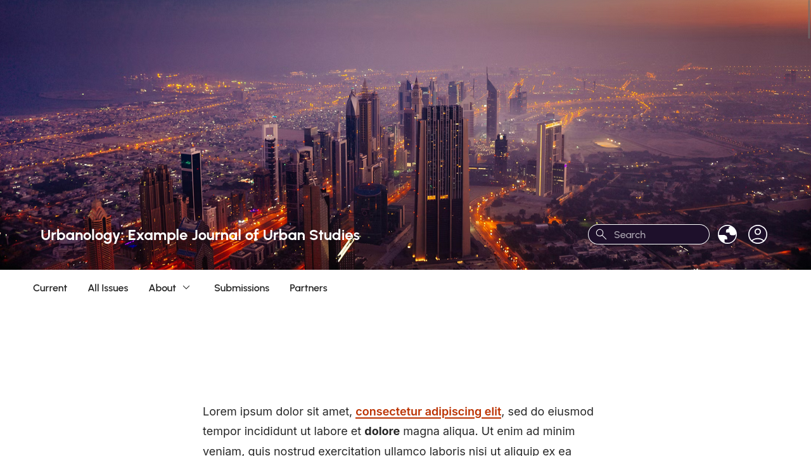 |
| Default (Centered) | 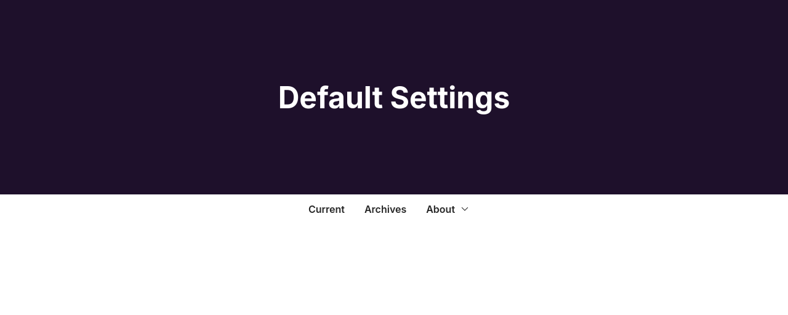 |
| One Line | 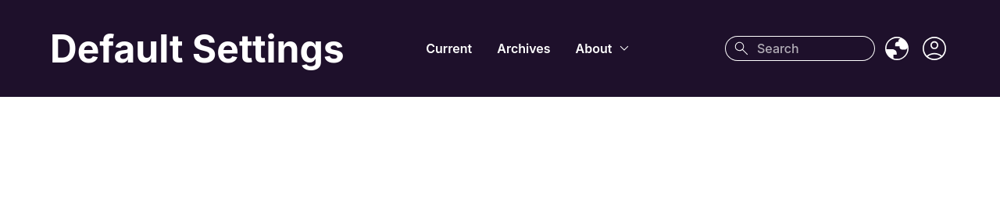 |

### Tagline

This option can be useful if the journal has a short description, motto, or other text that needs to accompany a logo.

### Homepage Image Position

This setting controls the position of the homepage image, which can be uploaded at **Settings > Website > Appearance > Setup > Homepage Image**.

When selecting one of the "behind header" options, care must be taken to ensure that text can be read clearly against the background image.

| Bad | Good |
| --- | --- |
| 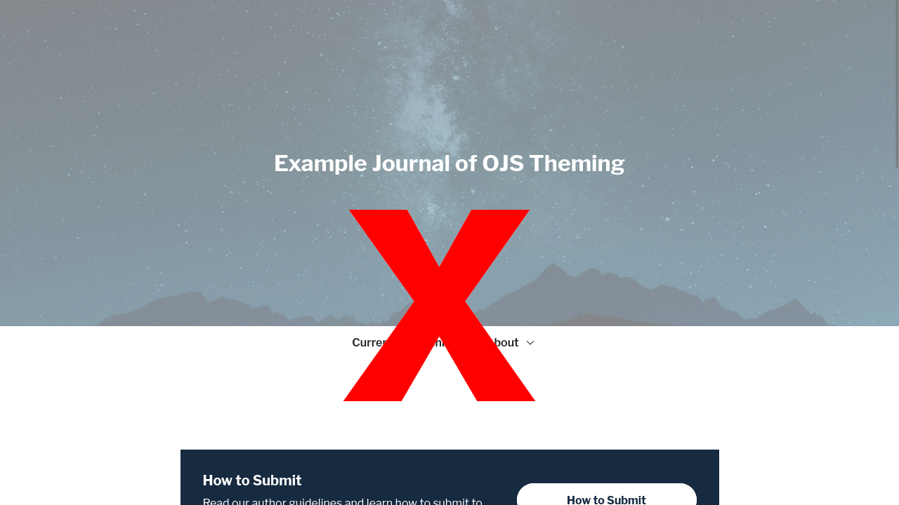 | 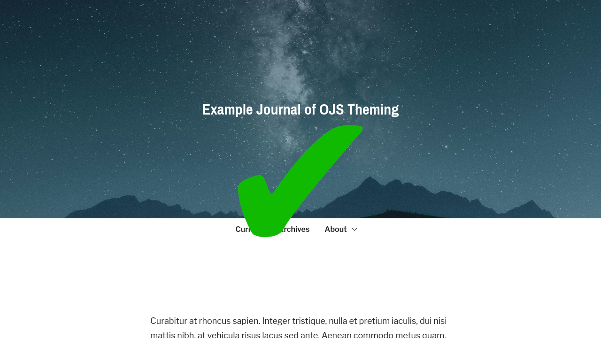 |

The following shows the most common options for the homepage image position.

| Option | Example |
| --- | --- |
| Above Header | 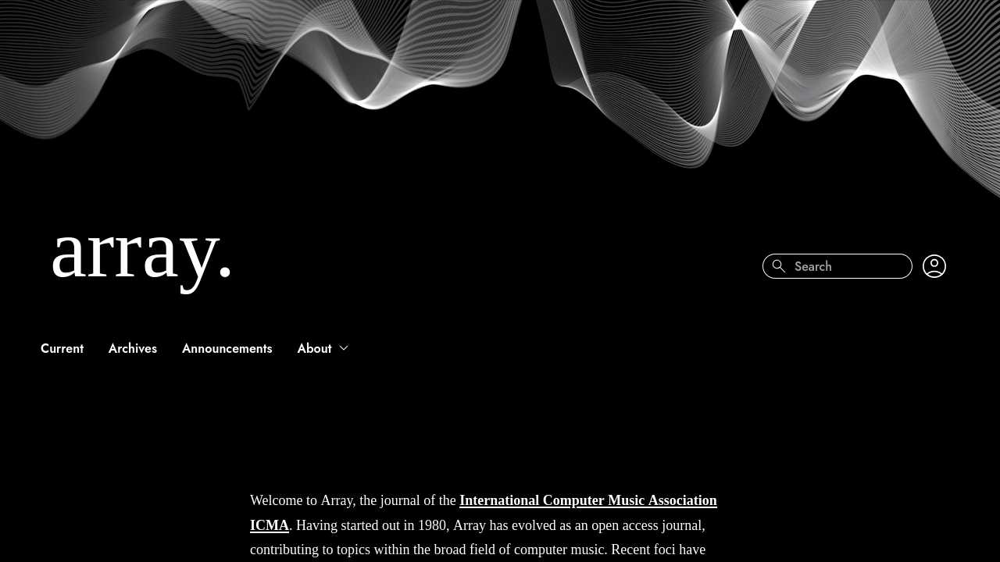 |
| Above Header (Center) | 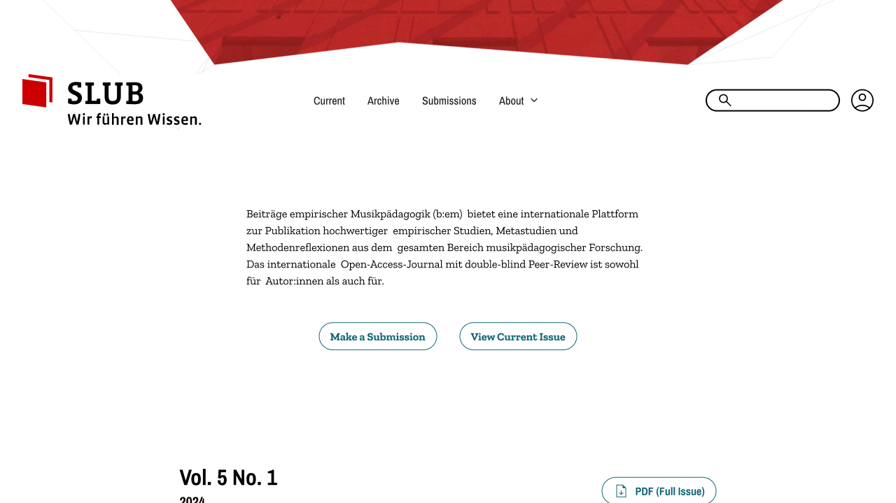 |
| Behind Header |  |
| Behind Header (Center Right) | 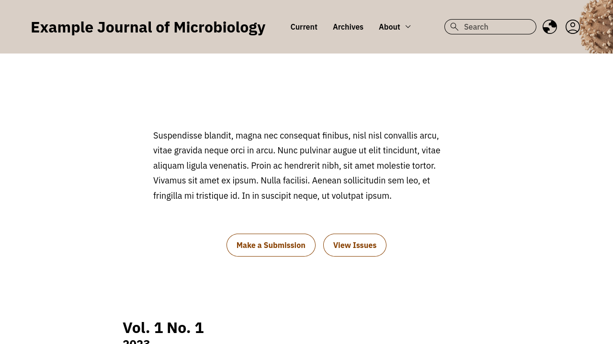 |
| Behind Header (Repeating Pattern) | 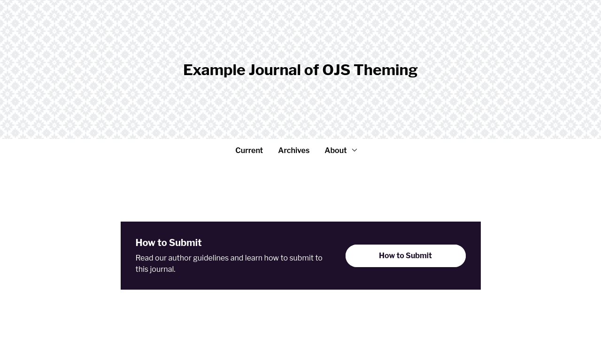 |
| Below Header | 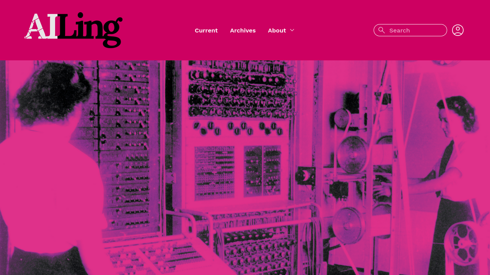 |

### Homepage Blocks

This setting allows you to add, remove, and reorder content on the homepage. Some of the blocks are not available unless you have a plugin enabled.

| Block | Description |
| --- | --- |
| About the Journal with Homepage Menu | Show a short description of the journal above a short navigation menu. Use this near the top of your homepage to provide a brief introduction to your journal and links to the most common resources, like the issue archive or the submission page. This block will display the content added to **Settings > Website > Advanced > Additional Content** or **Settings > Journal > About the Journal**. Add links to this block by creating a Menu at **Settings > Website > Setup > Navigation**. When creating the menu, assign it to the `homepage` **Active Theme Navigation Area**. |
| Browse by Category | Show a list of your article categories with a link to view all articles in each category. Enter a title and description for this block in the fields below this setting. |
| Current Issue (Summary) | Show the current issue cover along with a short summary and a link to the full issue. |
| Current Issue (Table of Contents) | Show the current issue's full table of contents. |
| Highlights | Display the journal's highlights. (Only available in OJS 3.5+.) |
| How to Submit | Show a small block with details about how to submit to the journal. Enter a title and description for this block in the fields below this setting. |
| Latest Announcement | Show one or more of your most recent announcements. Announcements must be enabled at **Settings > Website > Setup > Announcements**. |
| Latest Articles | Show a list of the most recently published articles. This is only useful for journals operating a publish-as-you-go model. If all articles in an issue are published at the same time, use the issue table of contents instead. Enter a title and description for this block in the fields below this setting. |
| Latest Articles (with Cover Images) | The same as the Latest Articles block above, but each article's cover image will also be displayed. Only enable one of these blocks. |
| Partners / Sponsors | Show partner logos in a grid layout. Enter a title and description for this block in the fields below this setting. (The **Partner Logos** plugin must be installed and enabled.) |
| Plugin Content | Add this block if the journal uses a plugin that automatically adds content to the homepage. |

### Highlight Article Metadata

In the Individualize theme, most of the article metadata appears in a table at the bottom of the article. This option allows you to show some key information, like keywords or a DOI, directly under the title and author.

The **Published In Issue/Journal** setting provides a snapshot of the issue the article was published in. This can bring attention to the journal when users reach the article landing page directly, and may not be familiar with the journal.

### Article HTML Full Text

> **Most journals will need to make special adjustments to display full-text article content.**

The theme includes a feature to extract the full text from a HTML galley and display it directly on the landing page. This only works when the HTML galley has been formatted in a specific way.

To use the built-in full-text feature, your HTML must include:

- An `<article>` tag that includes the main content of the article (excluding the title, authors, and abstract).
- An `<aside>` tag that includes the references of the article.
- All headings in the `<article>` must use `<h3>` or `<h4>` to be shown in the table of contents.

Coders can follow this [example child theme](https://github.com/NateWr/exampleIndividualizeChild) to write a custom full-text extractor that matches their journal's HTML format.

### Issue Archives

It is recommended that you only show cover images on the issue archive if each issue has a visually unique cover.

| Option | Example |
| --- | --- |
| List of issue summaries | 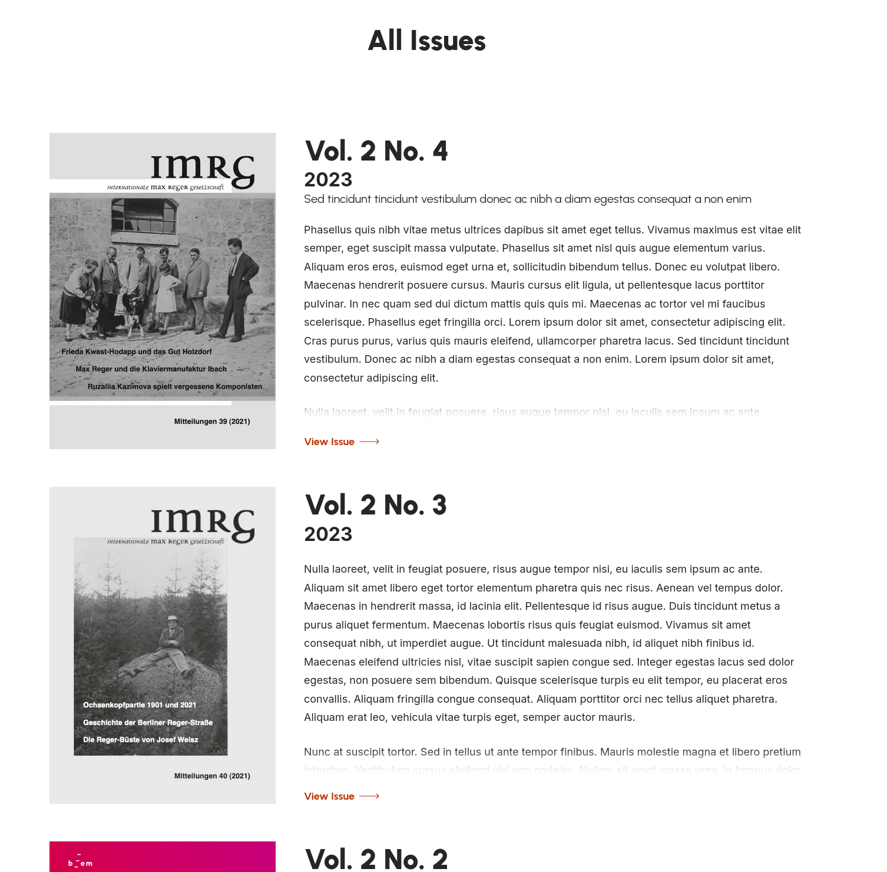 |
| Galley of issue cover images | 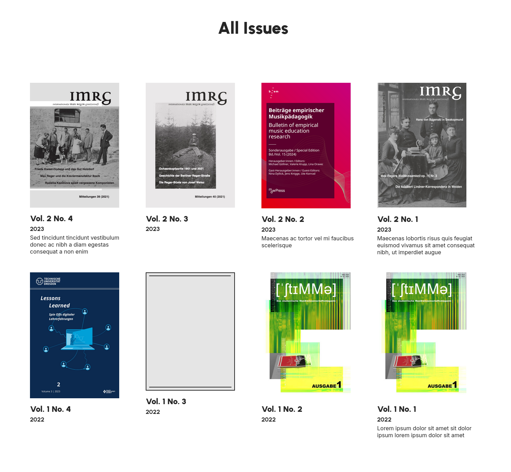 |
| List of issue summaries without cover images |  |

## Fonts

When you have installed and enabled the **Google Fonts** plugin, the theme allows you to assign fonts from that plugin to specific parts of the theme.

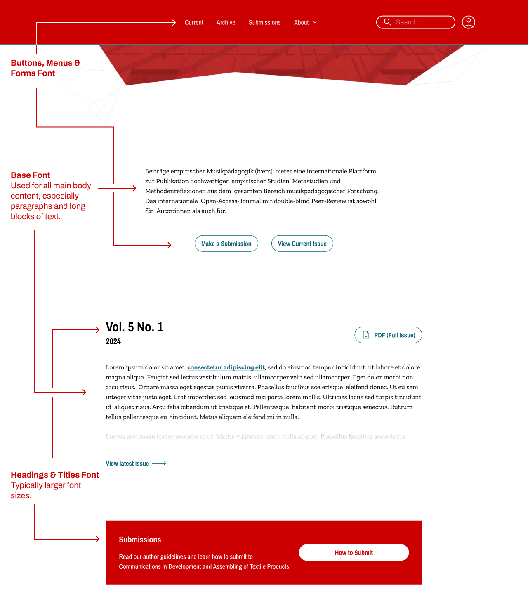

## Colors

> It is **strongly recommended** to use the theme's simple color mode. When using the simple color mode, the theme automatically adjusts all elements to ensure they are legible and provides a base level of support for color contrast in accessibility criteria.

When you have selected the **Simple Mode**, the theme allows you to choose a **Primary** and **Secondary** color. This will automatically apply the journal's brand colors to different parts of the site while ensuring sufficient color contrast between text and different backgrounds.

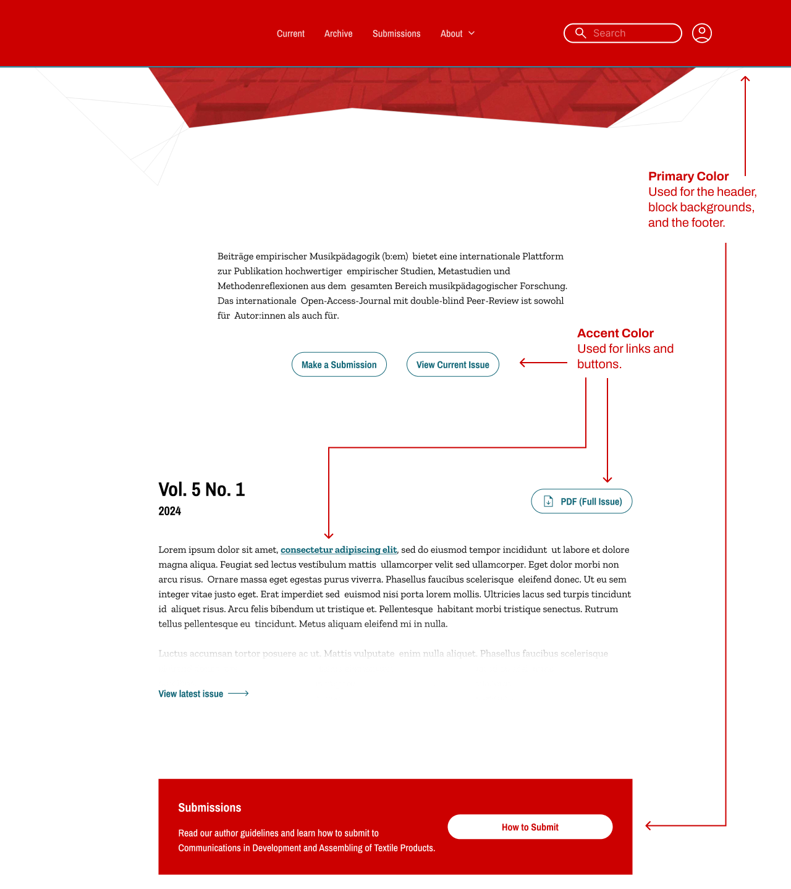

When you have selected the **Advanced Mode**, the theme allows you to set a different background, text, and link color for each part of the site. When using this mode, it is your responsibility to ensure that all text is legible with your color selection. You should plan to test carefuilly across multiple different devices to ensure your site meets accessibility criteria for color contrast.

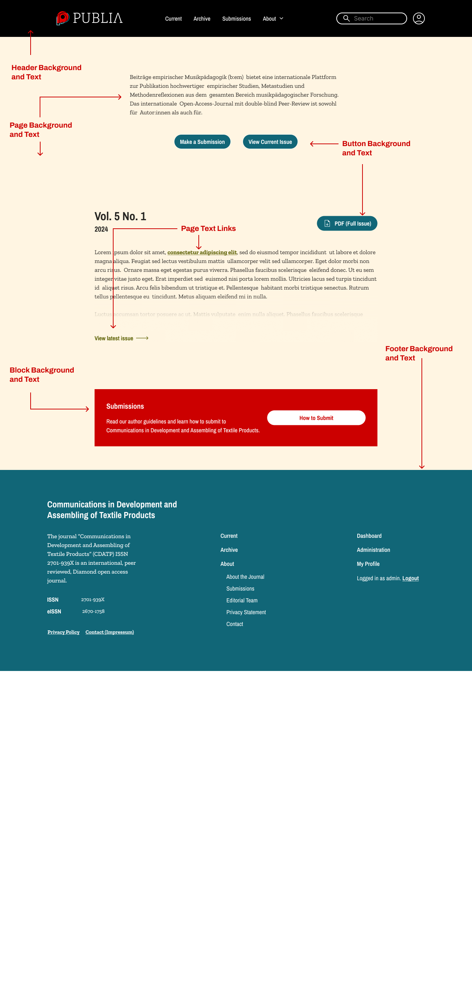
