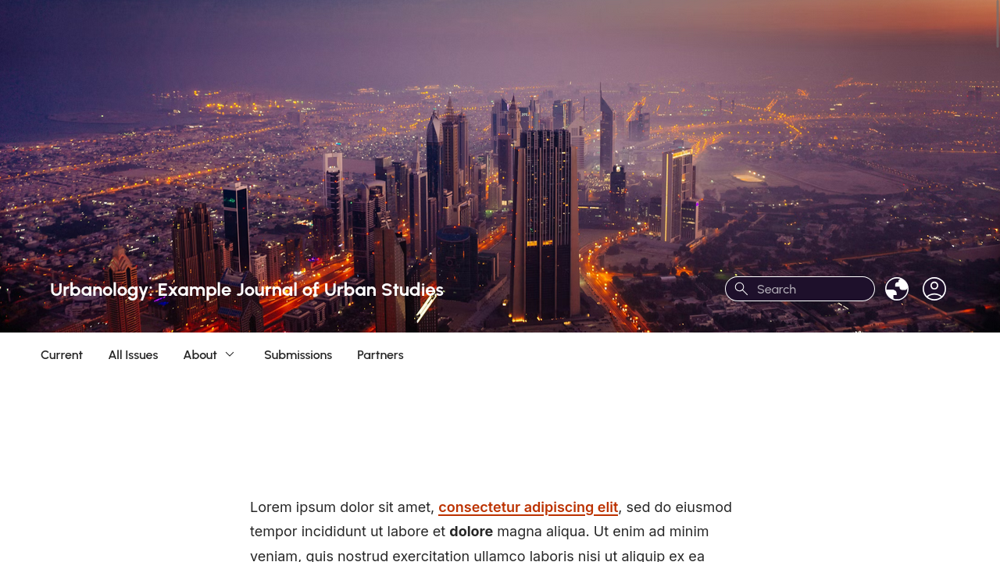

# Individualize Theme by Publia

A custom theme for OJS to allow editors to customize the design and layout of their journal.



# Install

> This theme is available for OJS 3.3.0-21+. If you don't see it in the list of available plugins, it is not compatible with the version of OJS you are running.

Follow these steps to install the plugin on your OJS site.

1. Login to your OJS site as an Administrator or Journal Manager.
2. Go to Settings > Website > Plugins > Plugin Gallery.
3. Click **Individualize Theme** in the list of available plugins.
4. Click **Install**.
5. Reload the page.
6. Go to Settings > Website > Appearance > Theme.
7. Select **Individualize Theme** as the Theme option and save the form.

Read the [usage guide](./docs/usage.md) to learn more about the theme options.

# Develop and Contribute

This theme uses [Vite](https://vitejs.dev/) to build CSS/JS assets.

Install dependencies.

```bash
npm install
```

Run the following commands to sync CSS/JS assets with Vite's HMR server while editing the theme.


```bash
npm run start
```

Two bundles are built. One for the main site (`src/main.js`) and a smaller bundle for the PDF and HTML galley pages (`src/galley.js`).

## Package and Release

Update the version in the `package.json` file.

```
  "version": "<version>",
```

Update the version and date in the `version.xml` file.

```
  <release>[version]</release>
  <date>[YYYY-MM-DD]</date>
```

Build the assets for distribution.

```bash
npm run build
```

Create a `.tar.gz` package of this theme by running the following command in the directory above the theme.

```
tar -czf individualizeTheme-<version>.tar.gz --exclude-ignore=.tarignore individualizeTheme
```

Replace the `<version>` with the correct version, such as `1.2.0.0`.